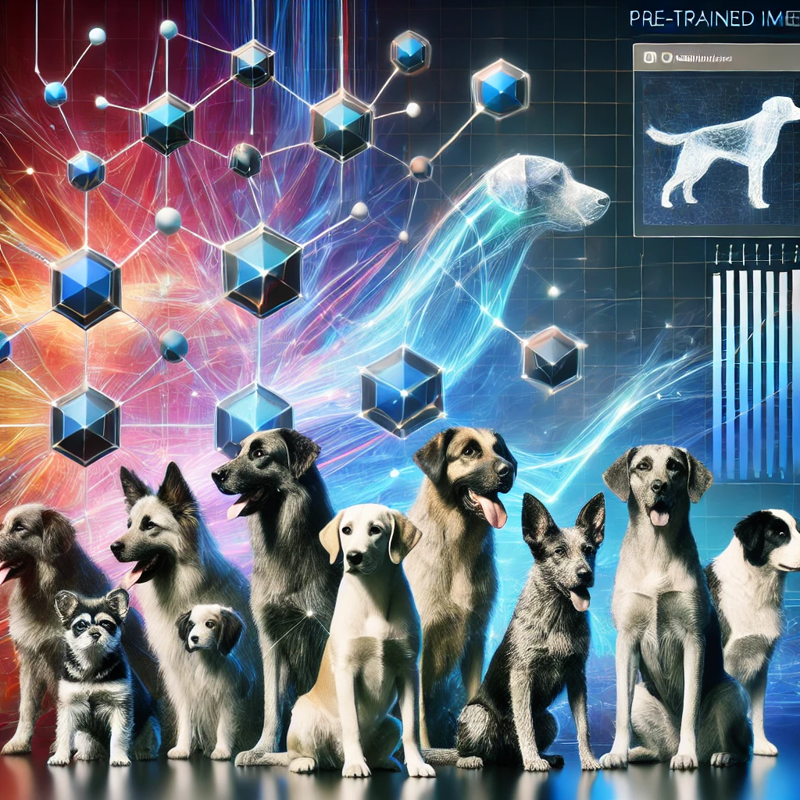
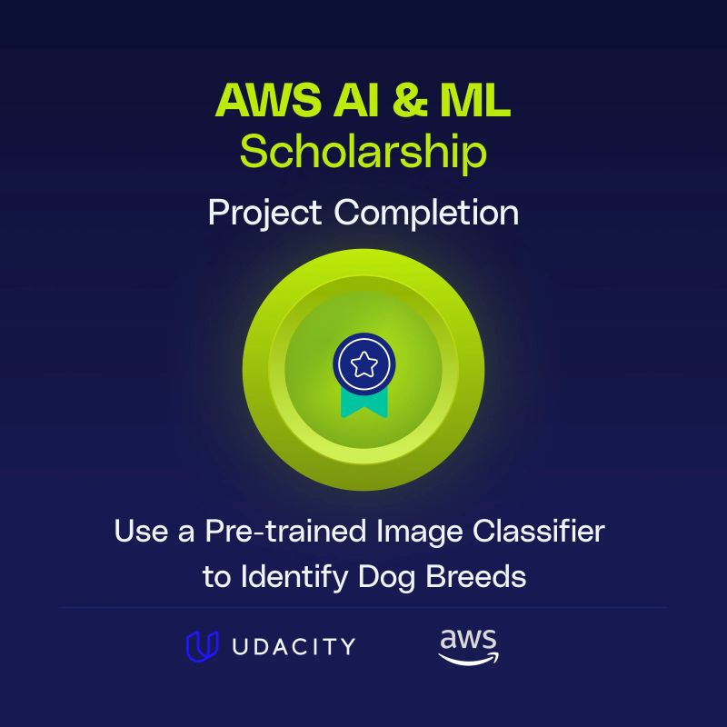

# 🐕 Pre-trained Image Classifier for Dog Breed Identification


A Python application that uses pre-trained CNN models (ResNet, AlexNet, VGG) to classify dog breeds and validate 
whether images contain dogs. This project focuses on leveraging existing neural network architectures to perform 
accurate image classification.





## 🎯 Principal Objectives
   1. Accurately identify dog images vs. non-dog images
   2. Correctly classify dog breeds in dog images
   3. Compare performance across CNN architectures (ResNet, AlexNet, VGG)
   4. Evaluate time-efficiency of different models

## 📂 Project Structure
```
dog_breed_identification/
├── pet_images/                  # Test images directory
├── uploaded_images/             # Directory for user uploaded images
├── dognames.txt                 # Reference file of valid dog names
├── check_images.py              # Main program
├── classifier.py                # CNN classifier implementation
├── get_input_args.py            # Command line argument handling
├── get_pet_labels.py            # Image label processing
├── classify_images.py           # Image classification logic
├── adjust_results4_isadog.py    # Dog validation
├── calculates_results_stats.py  # Statistics calculation
├── print_results.py             # Results output formatting
├── run_models_batch.sh          # Batch processing script for test images
└── run_models_batch_uploaded.sh # Batch processing for uploaded images
```
## 💻 Usage
### Running on Test Images
```bash
sh run_models_batch.sh
```
This will execute

```bash
python check_images.py --dir pet_images/ --arch resnet --dogfile dognames.txt > resnet_pet-images.txt
python check_images.py --dir pet_images/ --arch alexnet --dogfile dognames.txt > alexnet_pet-images.txt
python check_images.py --dir pet_images/ --arch vgg --dogfile dognames.txt > vgg_pet-images.txt
```
### Testing Your Own Images
  1. Place your images in the uploaded_images/ directory
  2. Run the batch script:
```bash
sh run_models_batch_uploaded.sh
```
The script will process your images through all three models and save the results in separate text files.

## 📊 Performance Metrics
  - The program calculates and reports:
  - Number of images processed
  - Number of dog/non-dog images
  - Percentage of correct dog classifications
  - Percentage of correct breed classifications
  - Percentage of correct non-dog classifications
  - Total runtime for each model

## 🎯 Model Performance
Results across different architectures:
```
| Model   | Dog Detection | Breed Classification | Runtime |
|---------|---------------|----------------------|---------|
| VGG     | 100%          | 93.3%                | Slower  |
| AlexNet | 100%          | 80.0%                | Faster  |
| ResNet  | 90%           | 82.0%                | Medium  |
```
## 🚀 Getting Started
1. Clone the repository
2. Install requirements:
```bash
pip install torch torchvision pillow
```
3. Place test images in pet_images/ directory 
4. Run the classifier
```bash
 python check_images.py --dir pet_images/ --arch vgg --dogfile dognames.txt
```

## 💫 Recognition
This project received high praise for its:
- Clean and well-structured code
- Comprehensive documentation
- Excellent implementation of all requirements
- Clear and well-commented codebase

## 🙏 Acknowledgments
- Amazon AWS
- Udacity
- ImageNet dataset
- PyTorch team
- Pre-trained model providers
- Original CNN architecture developers

## 📝 License
This project is licensed under the MIT License - see the LICENSE file for details.
